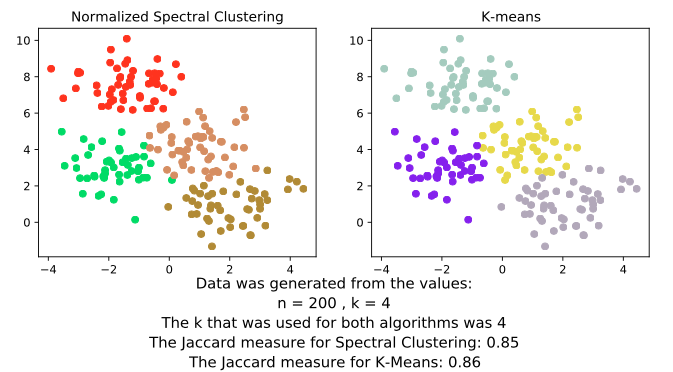
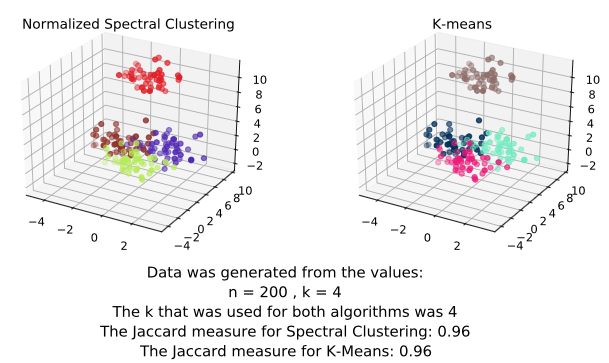

# Spectral Clustering 
The purpose of this project is to implement a version of the normalized spectral clustering algorithm. Given a set of n data points (that may be 2 or 3 dimensional) we aim to partition them into k meaningful clusters. 

## Implementation
In order to find the best partition the observations, X = {x1, x2, ..., xn}, are transformed into a weighted, undirected graph representation with no self loops: G = (V,E;W). Each observation xi is represented as a vertex vi ∈ V. The set of graph edges, E, consists of connected pairs {vi,vj}. From this weighted adjacency matrix, W, the normalized graph Laplacian, Lnorm, gets computed. We are interested in this graph for 2 reasons. Firstly, it has n non-negative real-valued eigenvalues. Secondly, it has orthogonal real-valued eigenvectors. Via a modified gram-schmidt algorithm and QR iteration algorithm all the eigenvectors and eigenvalues of Lnorm are found. Next, the number of clusters, K, is determined. Depending on user input, either the K used is the K provided as input to the program, or the eigengap heuristic is employed to find an optimal K. The eigengap heuristic measures the stability of the normalized graph Laplacian by means of it's eigenvalues. Once K is determined, the first K eigenvectors--the eigenvectors corresponding to the K smallest eigenvalues--of Lnorm are obtained. From them a new matrix U is created. The columns of U are the K eigenvectors extracted from Lnorm. Matrix T is created by normalizing each of U's rows to unit length. Each row of T is regarded as a K-dimensional point and clustered into one of K clusters via K-means clustering (where the initial centroids are chosen via K-means++ algorithm). If row i gets assigned to cluster j, the original point xi will be assigned to cluster j. 

For performance considerations, the K-means algorithm is implemented in C and interacts with the rest of the algorithm using a Python/C API.

## Generated Files
Three files are created every time this program is run. 
- **data.txt**: contains the data generated by the random Data Points Generation. Each line represents a single point and the point dimensions are comma separated. The last value on each line is the integer label for cluster membership of that data point. 
- **clusters.txt**: contains the computed clusters from both algorithms. The first line is the K that was used. The next K lines represent the clusters computed by the Normalized Spectral Clustering Algorithm--each line has the indices of points belonging to the same cluster. The last K lines follow the same pattern for the clusters computed by K-means.
- **clusters.pdf**: contains two visualizations of the clusters as calculated by Normalized Spectral Clustering and K-means. The plots will either be 2 or 3 dimensional, depending on d. Aside from the visualizations, descriptive information will also be displayed. In particular the following is noted: the k and n used to randomly generate the data points, the K used by both algorithms, and the Jaccard measure of both clustering algorithms. The Jaccard measure indicates the quality of the clustering (the closer to 1 the better).

### Example for d=2:

### Example for d=3:

## Running the Program
    python -m invoke run -k -n --no-Random

- The invoke command run (defined in tasks.py)creates all setup needed to run the program and will execute it.  
- The third value set's Random to False. By default this parameter is True and can be made true by either not specifying anything, passing -R, or passing -Random. If Random is true, K and n don't even need to be provided. 

### K and N:
- **k** is the number of clusters
    - Must be a positive integer strictly less than n
- **n** is the number of data points
- **Random** is a boolean typed variable that indicates how the data should be generated. If Random is false, data will be generated using the user-specified k and n. Otherwise, n and k are set to be random integers in the ranges (MAX_CAP_N // 2, MAX_CAP_N) and (MAX_CAP_K // 2, MAX_CAP_K) respectively. MAX_CAP_N represents approximately the maximum number of data points that can be clustered into the maximum amount of clusters (MAX_CAP_K) by the program within 5 minutes. There are unique MAX_CAP_N and MAX_CAP_K values for the 2D and 3D cases. 

## Summary
As the number of clusters increases, the number of data points that can be grouped into those clusters within 5 minutes decreases. Consequently, in attempting to maximize the parameters MAX_CAP_K and MAX_CAP_N simultaneously, a balance needs to be struck. Increasing MAX_CAP_N at the expense of MAX_CAP_K was favored because as K increases, the quality of the clustering decreases (as made evident by the Jaccard measure).